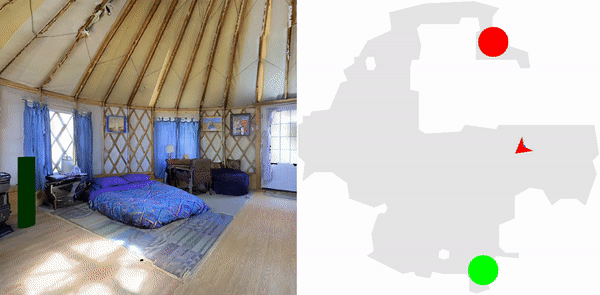

# MultiON: Benchmarking Semantic Map Memory using Multi-Object Navigation
This repository hosts the code for the following paper:
* Saim Wani*, Shivansh Patel*, Unnat Jain*, Angel X. Chang, Manolis Savva, _MultiON: Benchmarking Semantic Map Memory using Multi-Object Navigation_ in NeurIPS, 2020 ([PDF](https://shivanshpatel35.github.io/multi-ON/resources/MultiON.pdf))

[](https://nips.cc/)
[](https://github.com/facebookresearch/habitat-lab)

Project Website: https://shivanshpatel35.github.io/multi-ON/




## Installing dependencies:
This code is tested on ubuntu 18.04, python 3.6.10 and CUDA V9.1.85.

This code uses older version of [habitat-sim](https://github.com/facebookresearch/habitat-sim) and [habitat-lab](https://github.com/facebookresearch/habitat-lab). Install them by running the following commands:

#### Installing habitat-sim:

```
git clone https://github.com/facebookresearch/habitat-sim.git
cd habitat-sim 
git checkout ae6ba1cdc772f7a5dedd31cbf9a5b77f6de3ff0f
pip install -r requirements.txt; 
python setup.py install --headless # (for headless machines)
python setup.py install # (for machines with display attached)
```

#### Installing habitat-lab:
```
git clone --branch stable https://github.com/facebookresearch/habitat-lab.git
cd habitat-lab
git checkout 676e593b953e2f0530f307bc17b6de66cff2e867
pip install -e .
```

Refer to [habitat-sim](https://github.com/facebookresearch/habitat-sim) and [habitat-lab](https://github.com/facebookresearch/habitat-lab) for detailed installation instructions. For installation issues in habitat, either raise an  issue in this repository, or in the corresponding habitat repository.


Install pytorch from https://pytorch.org/ according to your machine configuration. The code is tested on pytorch v1.4.0.

## Setup
Clone the repository and install the requirements:

```
git clone https://github.com/saimwani/multiON
cd multiON
pip install -r requirements.txt
```

Download Matterport3D data for Habitat by following the instructions mentioned [here](https://github.com/facebookresearch/habitat-api#data). `data` folder should be placed inside multiON folder.


Run the following commands to download multiON dataset and cached oracle maps:
```
cd data
mkdir datasets
cd datasets
wget -O multinav.zip "https://www.dropbox.com/s/src4dy0d5vnbpb8/multinav.zip?dl=0?dl=1"
unzip multinav.zip && rm multinav.zip
cd ../
wget -O objects.zip "https://www.dropbox.com/s/izra9xqcpl3hr66/objects.zip?dl=0?dl=1"
unzip objects.zip && rm objects.zip
wget -O default.phys_scene_config.json "https://www.dropbox.com/s/09yi2tsipb26leo/default.phys_scene_config.json?dl=0?dl=1"
cd ../
mkdir oracle_maps
cd oracle_maps
wget -O map300.pickle "https://www.dropbox.com/s/j25enox7kv76m3y/map300.pickle?dl=0?dl=1"
cd ../
```

The Matterport scene dataset and multiON dataset should be in data folder in the following format:

```
multiON/
  data/
    scene_datasets/
      mp3d/
        1LXtFkjw3qL/
          1LXtFkjw3qL.glb
          1LXtFkjw3qL.navmesh
          ...
    datasets/
      multinav/
        3_ON/
          train/
            ...
          val/
            val.json.gz
        2_ON
          ...
        1_ON
          ...
```				

## Usage

### Training

Agent type for different agents are listed in the table below

| Agent         |  Agent type      |
|---------------|------------------|
| NoMap         | `no-map`         |
| OracleMap     | `oracle`         |
| OracleEgoMap  | `oracle-ego`     |
| ProjNeuralmap | `proj-neural`    |
| ObjRecogMap   | `obj-recog`      |


Specify the dataset to train on [here](https://github.com/saimwani/multiON/blob/main/configs/tasks/multinav_mp3d.yaml#L48). Then run the following command: 

```
python habitat_baselines/run.py --exp-config habitat_baselines/config/multinav/ppo_multinav.yaml --agent-type proj-neural --run-type train
```
Note that the intended agent type must be specified.
### Pre-trained models

```
mkdir pretrained_models
``` 
To download a pre-trained agent model, run it's corresponding command

| Agent            | Run                                                                                                  |
|------------------|:----------------------------------------------------------------------------------------------------:|
| NoMap            |`wget -O pretrained_models/ckpt0.pth "https://www.dropbox.com/s/k431devrru88cgf/ckpt.40.pth?dl=0?dl=1"`|
| ProjNeural       |`wget -O pretrained_models/ckpt1.pth "https://www.dropbox.com/s/ziallf9eoo1i1sy/ckpt.40.pth?dl=0?dl=1"`|
| ObjRecog         |`wget -O pretrained_models/ckpt2.pth "https://www.dropbox.com/s/t1bkrc0qdzc8sgs/ckpt.39.pth?dl=0?dl=1"`|
| OracleEgoMap     |`wget -O pretrained_models/ckpt3.pth "https://www.dropbox.com/s/urp4lpozres07f5/ckpt.40.pth?dl=0?dl=1"`|
| OracleMap        |`wget -O pretrained_models/ckpt4.pth "https://www.dropbox.com/s/9io3qyaboobc9e8/ckpt.19.pth?dl=0?dl=1"`|

### Evaluation

To evaluate a pretrained agent model on the 3-ON test dataset, run the following command from the root folder (`multiON/`).

```
python habitat_baselines/run.py --exp-config habitat_baselines/config/multinav/ppo_multinav.yaml --agent-type proj-neural --run-type eval
``` 
Here also, the intended agent type must be specified.

Average evaluation metrics are printed on the console when evaluation ends. Detailed metrics are placed in `eval/metrics` directory. 

## Citation
>Saim Wani*, Shivansh Patel*, Unnat Jain*, Angel X. Chang, Manolis Savva, 2020. MultiON: Benchmarking Semantic Map Memory using Multi-Object Navigation in Neural Information Processing Systems (NeurIPS). [PDF](https://shivanshpatel35.github.io/multi-ON/resources/MultiON.pdf)

## Bibtex
```
  @inproceedings{wani2020multion,
  title={Multi-ON: Benchmarking Semantic Map Memory using Multi-Object Navigation},
  author={Saim Wani and Shivansh Patel and Unnat Jain and Angel X. Chang and Manolis Savva},
  booktitle={Neural Information Processing Systems (NeurIPS)},
  year={2020},
}
```

## Acknowledgements
This repository is built upon [Habitat Lab](https://github.com/facebookresearch/habitat-lab).
