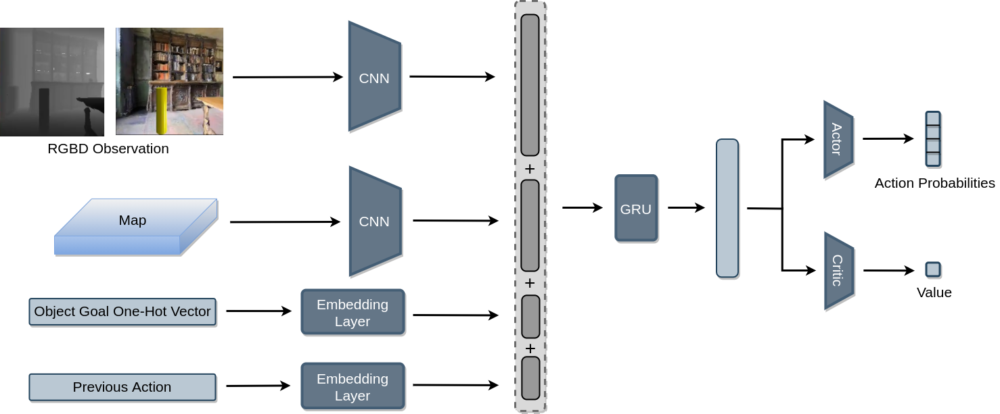

# MultiON: Benchmarking Semantic Map Memory using Multi-Object Navigation 

[](https://nips.cc/)
[](https://www.python.org/downloads/release/python-360/)
[](https://github.com/facebookresearch/habitat-lab)

This is a PyTorch implementation of our NeurIPS 2020 paper, [MultiON: Benchmarking Semantic Map Memory using Multi-Object Navigation](https://papers.nips.cc/paper/2020/file/6e01383fd96a17ae51cc3e15447e7533-Paper.pdf).

Project Webpage: https://shivanshpatel35.github.io/multi-ON/


## Architecture Overview




## Installing dependencies:
This code is tested on ubuntu 18.04, python 3.6.10 and CUDA V9.1.85.

This code uses older version of [habitat-sim](https://github.com/facebookresearch/habitat-sim) and [habitat-lab](https://github.com/facebookresearch/habitat-lab). Install them by running the following commands:

#### Installing habitat-sim:

```
git clone https://github.com/facebookresearch/habitat-sim.git
cd habitat-sim 
git checkout ae6ba1cdc772f7a5dedd31cbf9a5b77f6de3ff0f
pip install -r requirements.txt; 
python setup.py install --headless # (for headless machines)
python setup.py install # (for machines with display attached)
```

#### Installing habitat-lab:
```
git clone --branch stable https://github.com/facebookresearch/habitat-lab.git
cd habitat-lab
git checkout 676e593b953e2f0530f307bc17b6de66cff2e867
pip install -e .
```

We know that roadblocks can come up while installing Habitat, we are here to help! For installation issues in habitat, feel free to raise an issue in this repository, or in the corresponding habitat repository.


Install pytorch from https://pytorch.org/ according to your machine configuration. The code is tested on pytorch v1.4.0.

## Setup
Clone the repository and install the requirements:

```
git clone https://github.com/saimwani/multiON
cd multiON
pip install -r requirements.txt
```

### Download Matterport3D scenes and multiON dataset

The Matterport scene dataset and multiON dataset should be in data folder in the following format:

```
multiON/
  data/
    scene_datasets/
      mp3d/
        1LXtFkjw3qL/
          1LXtFkjw3qL.glb
          1LXtFkjw3qL.navmesh
          ...
    datasets/
      multinav/
        3_ON/
          train/
            ...
          val/
            val.json.gz
        2_ON
          ...
        1_ON
          ...
```				

Run the following to download multiON dataset and cached oracle occupancy maps:
```
mkdir data
cd data
mkdir datasets
cd datasets
wget -O multinav.zip "https://www.dropbox.com/s/hu6lugw1t766gcp/multinav.zip?dl=0?dl=1"
unzip multinav.zip && rm multinav.zip
cd ../
wget -O objects.zip "https://www.dropbox.com/s/izra9xqcpl3hr66/objects.zip?dl=0?dl=1"
unzip objects.zip && rm objects.zip
wget -O default.phys_scene_config.json "https://www.dropbox.com/s/09yi2tsipb26leo/default.phys_scene_config.json?dl=0?dl=1"
cd ../
mkdir oracle_maps
cd oracle_maps
wget -O map300.pickle "https://www.dropbox.com/s/j25enox7kv76m3y/map300.pickle?dl=0?dl=1"
cd ../
```

Download Matterport3D data for Habitat by following the instructions mentioned [here](https://github.com/facebookresearch/habitat-api#data). The scenes should be placed in `data` folder created above.  

## Usage

### Pre-trained models

```
mkdir model_checkpoints
``` 
Download a pre-trained agent model as shown below.

| Agent            | Run                                                                                                  |
|------------------|:----------------------------------------------------------------------------------------------------:|
| NoMap            |`wget -O model_checkpoints/ckpt.0.pth "https://www.dropbox.com/s/fe3bmw28djpes27/ckpt.39.pth?dl=0?dl=1"`|
| ProjNeural       |`wget -O model_checkpoints/ckpt.1.pth "https://www.dropbox.com/s/iuf8l022t4h9eca/ckpt.40.pth?dl=0?dl=1"`|
| ObjRecog         |`wget -O model_checkpoints/ckpt.2.pth "https://www.dropbox.com/s/kbn49t29oy319h1/ckpt.38.pth?dl=0?dl=1"`|
| OracleEgoMap     |`wget -O model_checkpoints/ckpt.3.pth "https://www.dropbox.com/s/urp4lpozres07f5/ckpt.40.pth?dl=0?dl=1"`|
| OracleMap        |`wget -O model_checkpoints/ckpt.4.pth "https://www.dropbox.com/s/9io3qyaboobc9e8/ckpt.19.pth?dl=0?dl=1"`|


### Evaluation


Note that the evaluation will run on the `3_ON` test set by default. To change this, specify the dataset path [here](https://github.com/saimwani/multiON/blob/main/configs/tasks/multinav_mp3d.yaml#L48).


To evaluate a pretrained OracleEgoMap (`oracle-ego`) agent, run this from the root folder (`multiON/`):

```
python habitat_baselines/run.py --exp-config habitat_baselines/config/multinav/ppo_multinav.yaml --agent-type oracle-ego --run-type eval
``` 

For other agent types, the `--agent-type` argument should be changed according to this table:


| Agent         |  Agent type      |
|---------------|------------------|
| NoMap(RNN)    | `no-map`         |
| OracleMap     | `oracle`         |
| OracleEgoMap  | `oracle-ego`     |
| ProjNeuralmap | `proj-neural`    |
| ObjRecogMap   | `obj-recog`      |


Average evaluation metrics are printed on the console when evaluation ends. Detailed metrics are placed in `eval/metrics` directory. 

### Training

For training an OracleEgoMap (`oracle-ego`) agent, run this from the root directory: 

```
python habitat_baselines/run.py --exp-config habitat_baselines/config/multinav/ppo_multinav.yaml --agent-type oracle-ego --run-type train
```
For other agent types, the `--agent-type` argument would change accordingly. 


## Citation
>Saim Wani*, Shivansh Patel*, Unnat Jain*, Angel X. Chang, Manolis Savva, 2020. MultiON: Benchmarking Semantic Map Memory using Multi-Object Navigation in Neural Information Processing Systems (NeurIPS). [PDF](https://shivanshpatel35.github.io/multi-ON/resources/MultiON.pdf)

## Bibtex
```
  @inproceedings{wani2020multion,
  title={Multi-ON: Benchmarking Semantic Map Memory using Multi-Object Navigation},
  author={Saim Wani and Shivansh Patel and Unnat Jain and Angel X. Chang and Manolis Savva},
  booktitle={Neural Information Processing Systems (NeurIPS)},
  year={2020},
}
```

## Acknowledgements
This repository is built upon [Habitat Lab](https://github.com/facebookresearch/habitat-lab).
